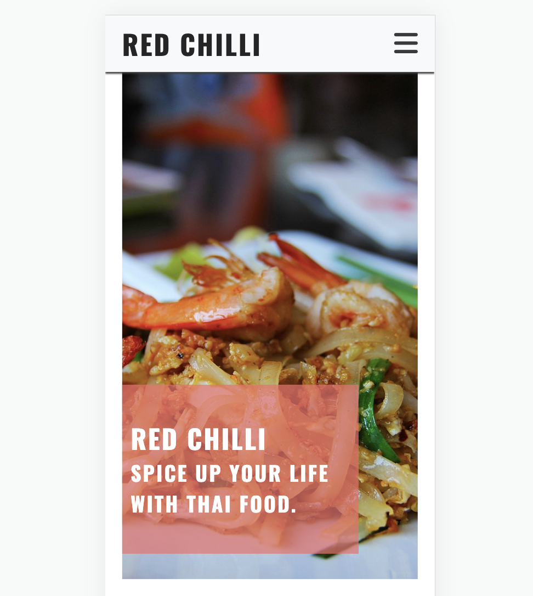

# Red Chilli
(Developer: Ittipon Simuang)

(/Users/ittisim/Red Chilli_project1/CI_PP1_TR/docs/features/Screenshot 2566-10-03 at 16.23.10.png)

[Live webpage](https://ittiponsim.github.io/CI_PP1_TR/index.html)

## Table of Content

1. [Project Goals](#project-goals)
    1. [User Goals](#user-goals)
    2. [Site Owner Goals](#site-owner-goals)
2. [User Experience](#user-experience)
    1. [Target Audience](#target-audience)
    2. [User Requrements and Expectations](#user-requrements-and-expectations)
    3. [User Stories](#user-stories)
3. [Design](#design)
    1. [Design Choices](#design-choices)
    2. [Colour](#colours)
    3. [Fonts](#fonts)
    4. [Structure](#structure)
    5. [Wireframes](#wireframes)
4. [Technologies Used](#technologies-used)
    1. [Languages](#languages)
    2. [Frameworks & Tools](#frameworks-&-tools)
5. [Features](#features)
6. [Testing](#validation)
    1. [HTML Validation](#HTML-validation)
    2. [CSS Validation](#CSS-validation)
    3. [Accessibility](#accessibility)
    4. [Performance](#performance)
    5. [Device testing](#performing-tests-on-various-devices)
    6. [Browser compatibility](#browser-compatability)
    7. [Testing user stories](#testing-user-stories)
8. [Bugs](#Bugs)
9. [Deployment](#deployment)"
10. [Credits](#credits)
11. [Acknowledgements](#acknowledgements)
<!-- 
## Project Goals 

### User Goals
- Finding a restaurant that offers a nice atmosphere and good food.
- See a full menu with clear pricing.
- Find information about the restaurant.
- Find the location of the restaurant

### Site Owner Goals
- Increase in the number of customers.
- Promote the bussines.
- Provide a way for new and existing customers to contact the buissnes.
- Provide essential information about the bussines to customers.

## User Experience

### Target Audience
- People looking for a place to dine at
- People looking to order take away
- Groups of people looking for a place to carter a event
- Small to medium wedding parties

### User Requrements and Expectations

- A simple and intuitive navigation system
- Quickly and easily find relevant information
- Links and functions that work as expected
- Good presentation and a visually appealing design regardless of screen size
- An easy way to contact the bussines
- Simple content that the user can skim read
- Accessibility

### User Stories

#### First-time User 
1. As a first time user, I want to know where the restaurant is lokated
2. As a first time user, I want to know the price range
3. As a first time user, I want to know more about the restaurant
4. As a first time user, I want to get a feel of what to expect at the restaurant

#### Returning User
5. As a returning user, I want to see the Sunday meal offer
6. As a returnign user, I want to know the opening times
7. As a returning user, I want to find a phone number to call for reservation
8. As a returning user, I want to see the menu
9. As a returning user, I want to leave some comment, suggestion or message to the staff
10. As a returning user, I want to find the restaurant on social media
11. As a returning user, I want to know who is preparing the food
12. As a returning user, I want to get directions to the restaurant

#### Site Owner 
13. As the site owner, I want users to find news about upcoming events or changes in opening times
14. As the site owner, I want users to get to know the restaurant 
15. As the site owner, I want the users to be able to contact us -- >